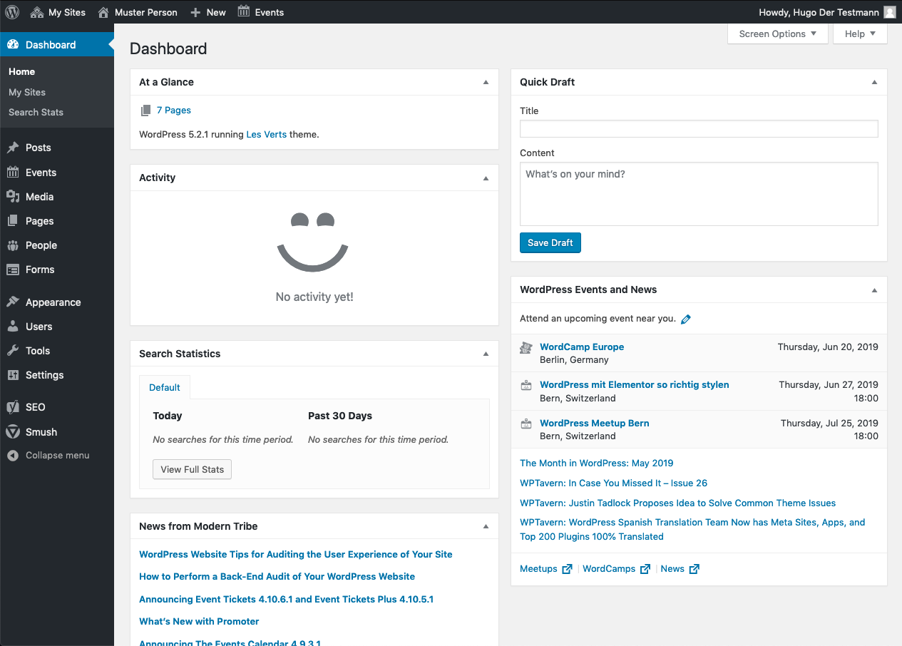
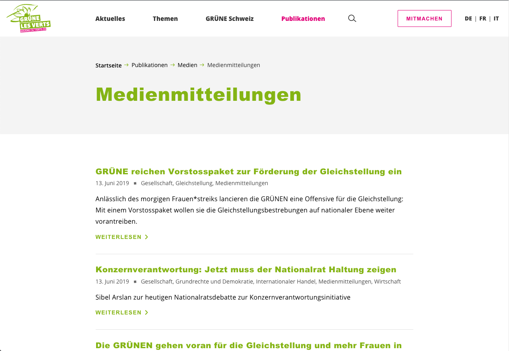

## Frontend
The actual website is referred to as the frontend. This is the part that you 
want to present the visitors and that can be reached via your web address. 
Example: [gruene.ch](https://gruene.ch)

## Backend
The backend is used to compose and change the content. That is, what is 
finally visible in the frontend. The backend can only be reached by login. To 
get to the backend, you call up the start page of our website and append 
`/wp-admin` to the URL. Example: 
[yourdomain.com/wp-admin](https://yourdomain.com/wp-admin)

## Content types
Content is presented to the user either on posts, pages, events or archives. 
Beginners often find it difficult to choose the right content type. Therefore, 
it is important to know the following types.

### Pages
Pages contain content that is usually unique and timeless. A classic example is 
the _contacts_ page. Unlike posts, pages are usually linked directly in the
menu.

### Posts
Posts are used for content that can be categorized. So p.ex. news, press 
releases etc. but not for static contents like the _about me_ or the 
_contact_ page. Posts appear in [archives](#archives) while pages don't. Posts
are usually not linked directly in the menu, but they can be reached over the 
archives of their categories. A post can be part of several archives.

### Archives
In the WordPress jargon, an archive refers to a collection of posts. The 
posts are automatically presented in their archive (selected by the category). 
It is impossible to add content directly to an archive. You must always 
create a post. Archives are created through a category and it's pages are 
only created through a [entry](2-8-navigation.md#categories-archives) in the 
navigation.

### Events
Events are used to announce your happenings. They display a few special fields 
like a time and a location where they take place. Once over the will be hidden 
from the default event archive, as soon as they are past.