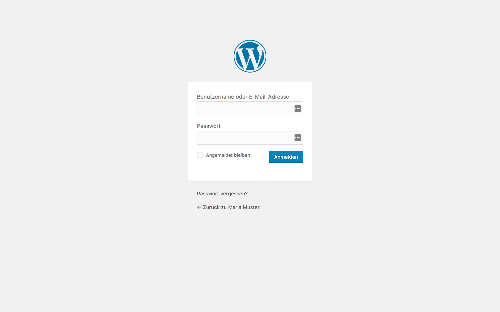

To edit your site, you first have to login to the 
[backend](1-2-terms.md#backend).

## Login address

> Add `/wp-admin` to your domain name to get to the login screen.

So the login address will be something like `https://yourdomain.com/wp-admin`.

## Lost password

The _lost your password_ function is your friend! You didn't get an email? 
Have you checked the spam folder?