## Precondition

Make sure you're [logged in](2-1-login.md).

## How to get to the edit screen

There are mainly two ways:
1. Go to the front page (on the [frontend](1-2-terms.md#frontend)) and click 
the _edit page_ button.
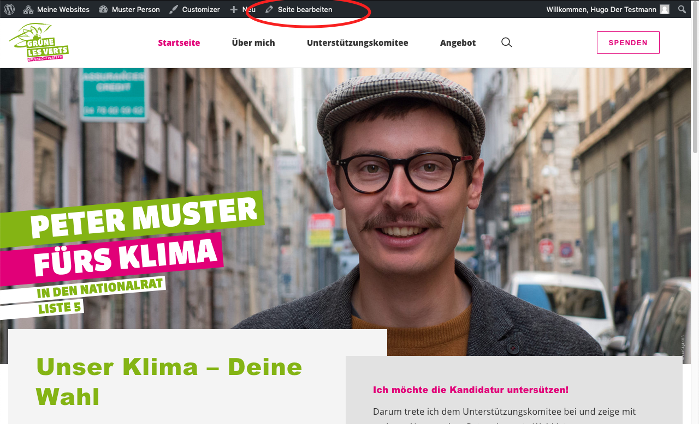

1. Go to _Pages_, hover the mouse pointer over the front page and click the 
_Edit_ link.
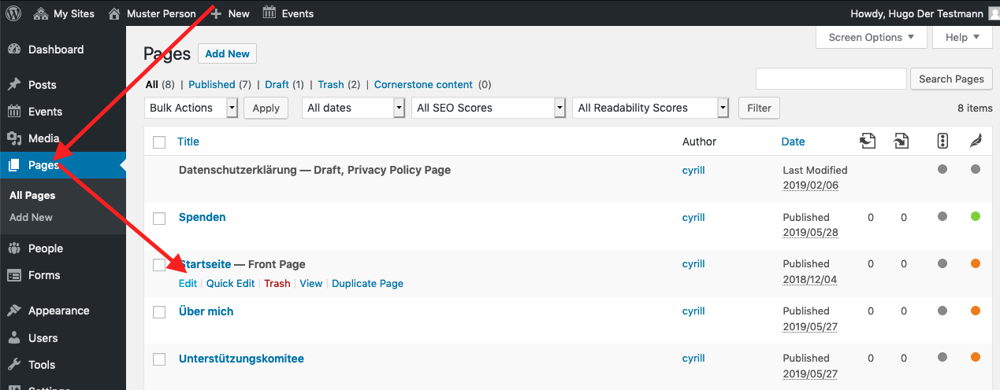

## You'll master it

The front page is the most advanced page to edit. Once you master it, editing 
other pages is peanuts 😁. And even the front page isn't that complicated!

## The main campaign

This is the main content block with the images the bars etc.
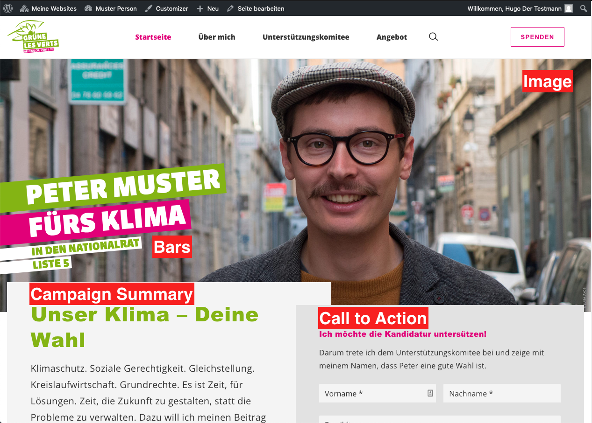

Just play around with the main campaign elements in the 
[edit mode](#how-to-get-to-the-edit-screen) of the front page and you'll find
out how it works.

### Campaign Summary
The main idea of the campaign summary is, to provide the reader with your 
main mission in very few words. If you need more space, you can create a 
dedicated page and link it to the campaign summary using the _Read more 
button_. For now, just keep it short. Once you know more about pages, adding
the link is intuitive.

### Call to Action
The call to action section is designed to easily involve your visitors. 
Add a form with a very low level involvement, like one to subscribe to your 
newsletter. See the [forms chapter](2-7-form.md) on how to create new forms.

## Saving changes
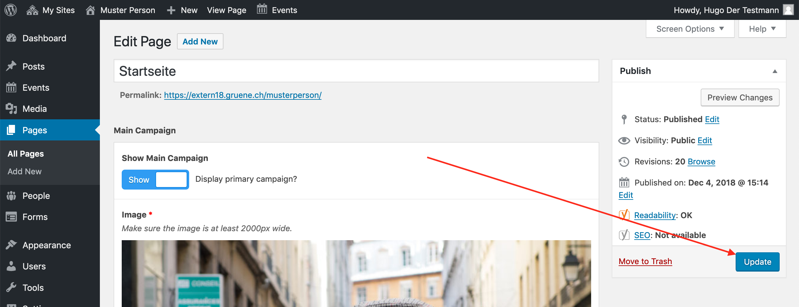
This may take a few seconds. Wait until the page reloads.

## The content blocks

All other content on the front page, is to be added and edited in the _Content
Blocks_ section. Content blocks can be positioned in any order and you are 
free to add any type of block.
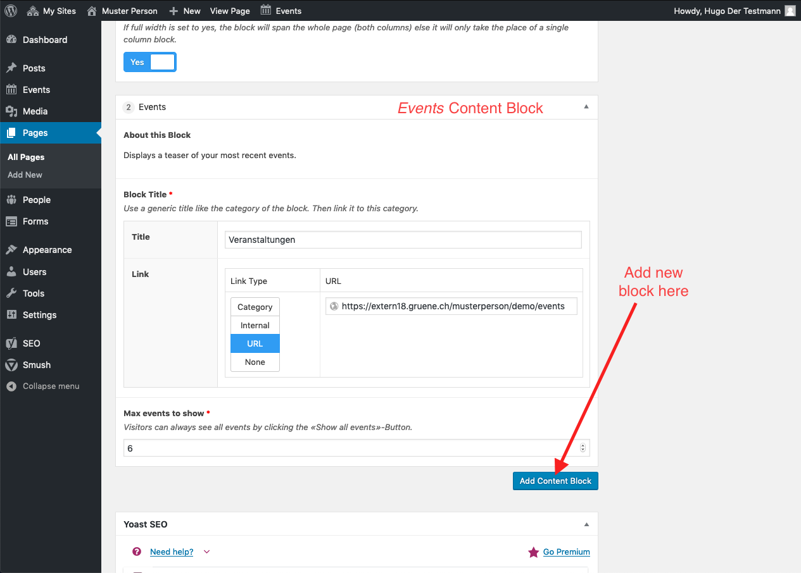

Every content block has a _Block Title_. The block title refers to this:
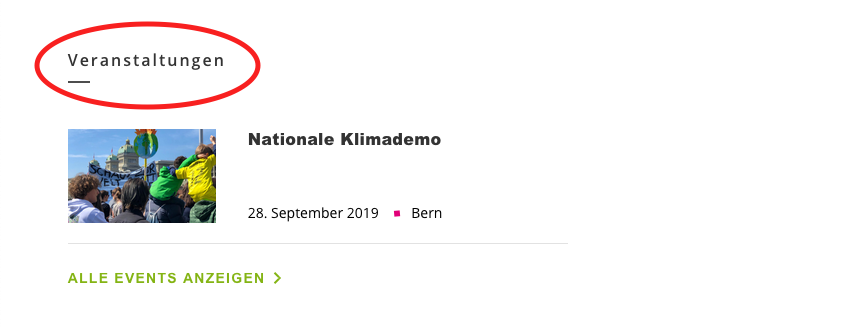
You can link the block title to an [archive](1-2-terms.md#archives) 
(category), any page, post or event on this website (internal), an external URL
or simply don't link it at all (none).

### Positions

Use the positions block to present your political views to the visitors with 
a few keywords. If you want to tell more about it, you are free to create a 
page for every position block and add it as read more target.
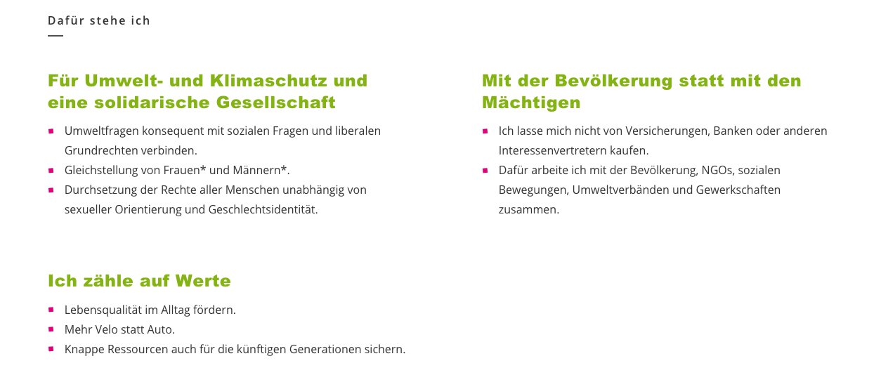

### Events

The events block displays your upcoming events. To create events, see the 
[events chapter](2-6-events.md).
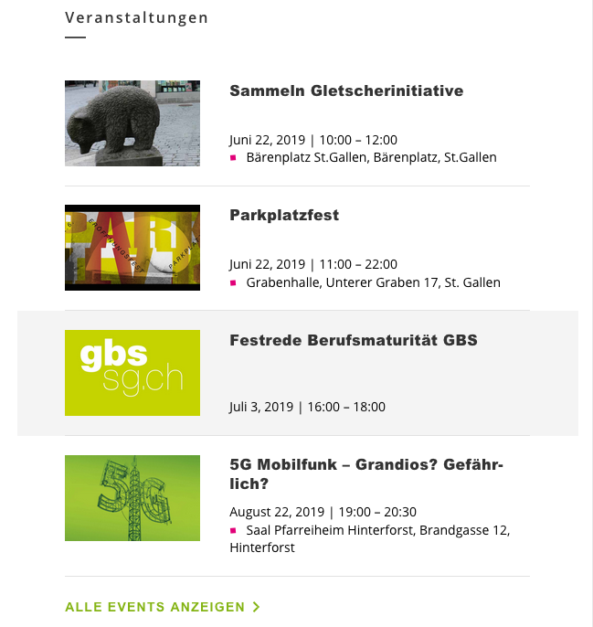

### Testimonials

Present your supporters using a testimonials block. You must add the 
testimonials in the [people section](3-1-people.md) first.
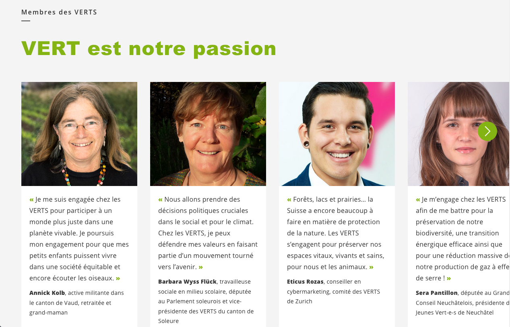

### Single Post / Page Teaser

If you want to feature a special page or post on your front page, use this 
block. Create the [page](2-3-page.md) or [post](2-4-post.md) first. This block
can be added multiple times.
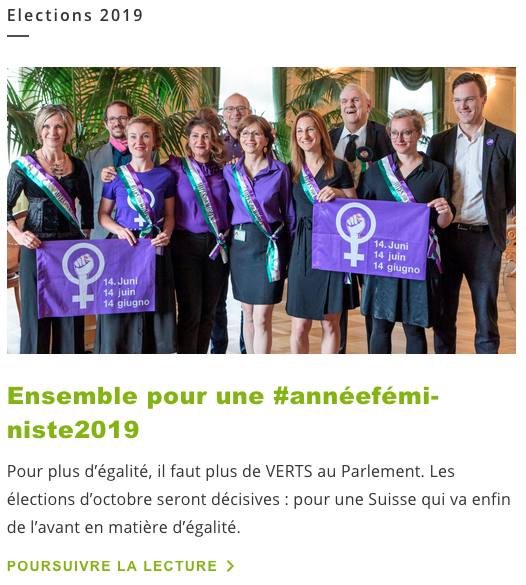 

### Double Post / Page Teaser

This works analogous to the 
[Single Post / Page Teaser](#single-post-page-teaser) but shows two teasers 
at once.
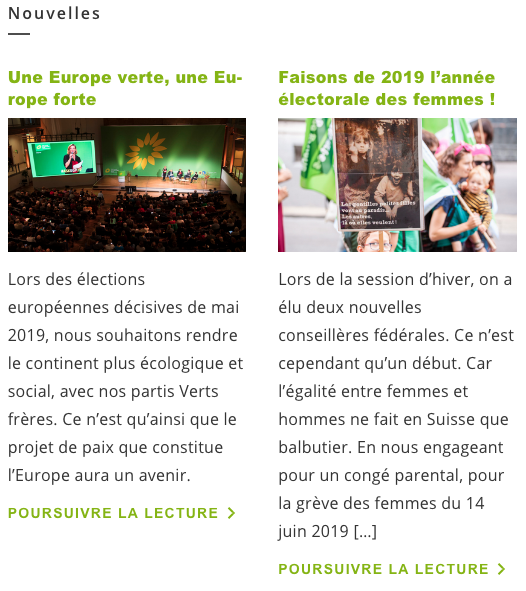 

### Latest Press Release

This block is especially designed for party websites. You can configure 
this block, to always display the newest [post](2-4-post.md) of a 
certain category (provided the posts were created with the 
[_Press Release_ template](2-4-post.md#template)). If the given 
post contains a quote, the quote will be displayed instead of the lead.

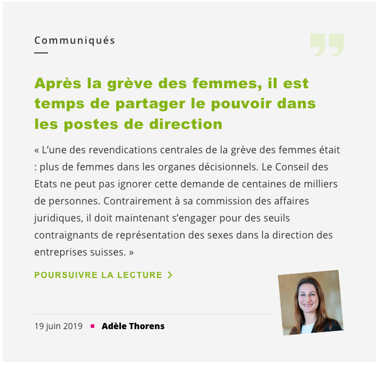

### Vote Recommendations

This block is especially designed for party websites. Place it close to the top.
The main goal is, to provide all your vote recommendations at single a glance.
You should link either a post where you explain your position in detail, or a
link to an external source, like a committee, where a votes can gather more 
information.
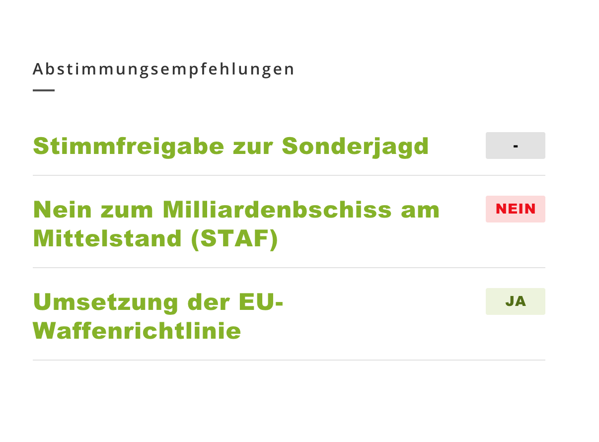

### Map Block

This is advanced. If you know enough to use it, you most probably don't need
this manual 😉

## Search engines and social media
We use the excellent third party plugin 
[Yoast SEO](https://yoast.com/wordpress-seo/) for search engine optimization and
to generate meta information for social media. It you want to know more, here is
a great [documentation](https://yoast.com/wordpress-seo/) from the vendor 
itself. However there is one very important thing, that you have to care 
about: The preview text of the front page for social media and search 
engines must be edited manually (on all other pages this goes automatically).

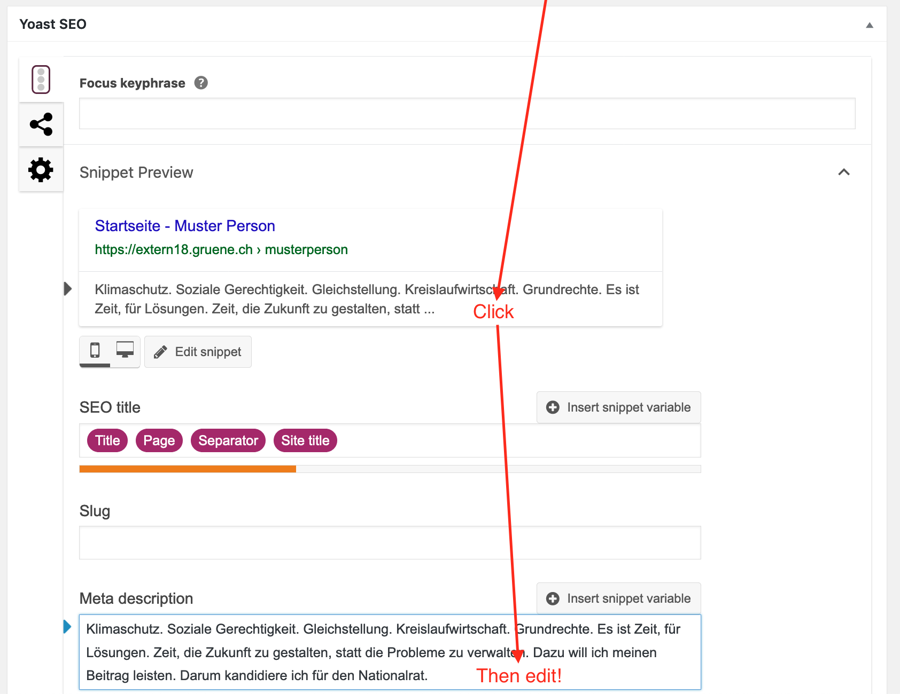
Scroll to the bottom of the edit page, then click on the preview text in the 
Yoast SEO metabox. A text field appears below. Enter your preview text here.

If you want to test how you site looks on facebook, if someone shares it, use
the [facebook debugger](https://developers.facebook.com/tools/debug/). 
Enter your URL and hit _Debug_. Since facebook caches things you might have 
to click _Fetch new scrape information_ twice.