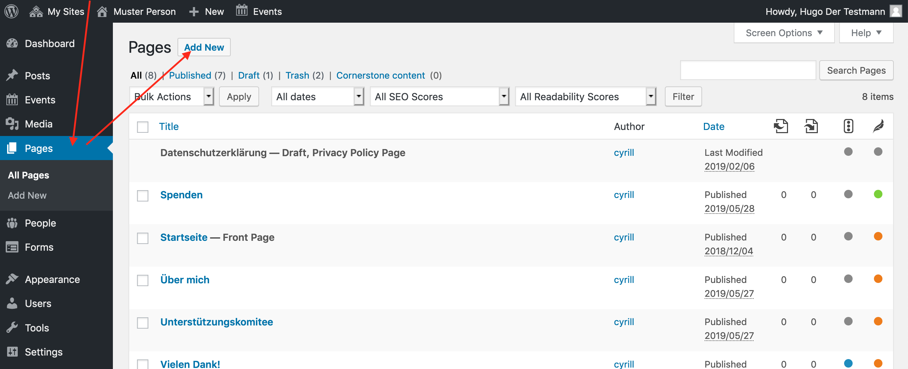
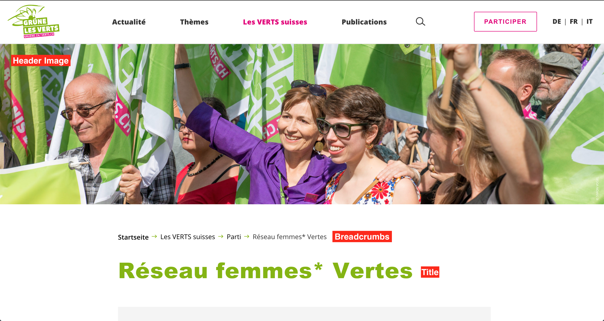
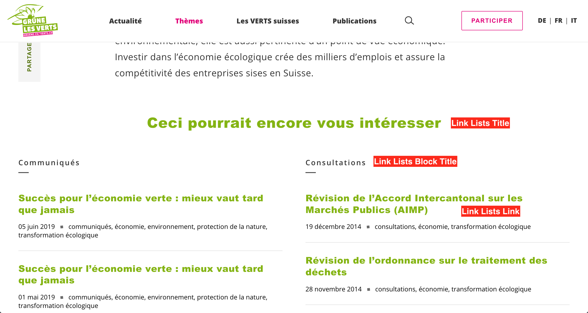

## Precondition

Make sure you
1. are [logged in](2-1-login.md).
1. are aware of the different 
[content types](1-2-terms.md#content-types).
1. know how to [save changes](2-2-front.md#saving-changes).

## Edit existing page
This works exactly as for the 
[front page](2-2-front.md#how-to-get-to-the-edit-screen).

## Add a new page

## Page elements

### Title
This is your main page title. You can choose a different title for the menu 
and the breadcrumbs.

### Teaser
By default the teaser is not visible on the page itself, but only used in 
article previews and for search engines. Its good practice to write a brief 
summary containing the most important keywords of this page.

If you want to use the teaser as lead, just toggle the switch below it and it
will appear on your page.

### Header Image 
The size of the header image depends on the visitors screen. It's therefore 
crucial to set the focal point correctly. Learn more about it in the 
[media chapter](2-5-media.md).  

### Content Blocks
As on the [front page](2-2-front.md#the-content-blocks), you can add multiple
content blocks in an arbitrary order using the _Add Content Block_ button. 
Most often you will just use a _Text_ block. If you want to find out more 
about a specific block, just add it. It contains a help text.

## Link Lists

This is optional, it's perfectly fine, if you leave it empty. However if you 
like to add some additional content, feel free to experiment with it. We 
invested, to explain it right in the editing mask.

## Navigation
In WordPress nothing appears in the navigation automatically. See the 
[navigation chapter](x-x-navigation.md) for details on how to add the page to
the navigation.