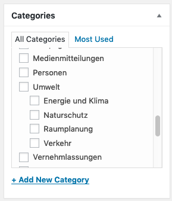
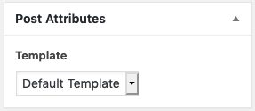

## Precondition

Make sure you
1. are [logged in](2-1-login.md).
1. are aware of the different 
[content types](1-2-terms.md#content-types).
1. know how to [save changes](2-2-front.md#saving-changes).

## Editing or adding a post

This works similar as for pages: In the [backend](1-2-terms.md#backend) go to 
_Posts_ then click _Add New_ or hover over the post you want to edit and 
click _Edit_. 

## Post elements

See the [elements for pages](2-3-page.md#page-elements) as it is the same 
for the [default template](#template).

## Categories

Every post must be assigned to at least one category. This allows you to 
display it in a corresponding [archive](1-2-terms.md#archives). You may tick 
an existing category or add a new one. 

If you don't assign a category, WordPress will automatically add it to the 
default category _Uncategorized_.  

> Don't be too specific with your categories. As member of parliament it might 
be a good idea to add a category _Motion_ or _Speech_. Use tags for more 
specific things like _solar energy_ or _AHV_.

The category will be displayed in the frontend.

By default your posts won't have a date. If you want them to have one (as on 
the screenshot above), you can configure so per category. Save your post, 
then navigate to _Posts_ > _Categories_ and edit the category you want to 
have a date and look out for the _Has date_ switch.

## Tags

Tags allow you to add keywords to your post. It does no harm to add a lot of 
them. They will be showed in the frontend just after the categories. Their 
main function is to provide an option to link multiple posts of the same 
topic. Their use is optional.

## Template

There are three different post templates available:
1. The _Default Template_ is the general template. It's what you will use 
most of the time.
1. The _Overview Page_ is here to create a nicely hand curated list of posts.
Don't use it for post lists, that will update frequently and maybe wont have 
an image. Use an [archive](2-8-navigation.md#categories-archives) instead.
1. The _Press Release_ template is here for your press releases. Use it only 
for this.

You can change the template in the _Post Attribues_ meta box, which is located
on the bottom of the right column.

If you can't see the meta box, you may have to enable it in the [screen 
options](#screen-options).

## Screen Options

WordPress let's you customize your edit screen. Tick any boxes you'd like to 
have visible.

