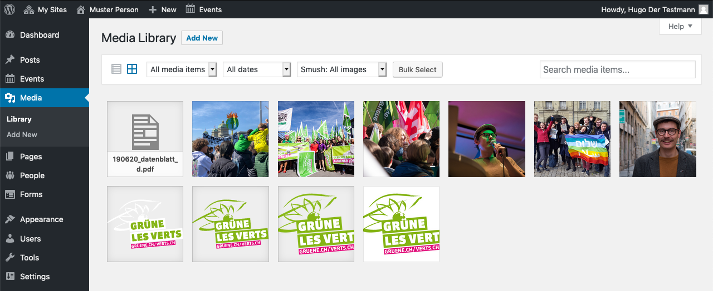
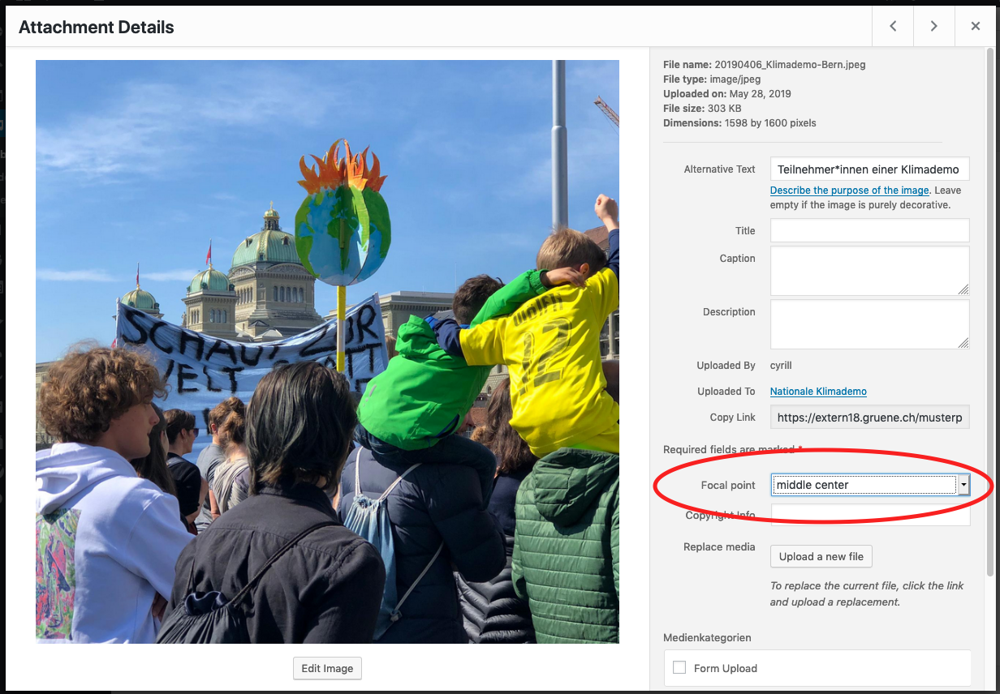
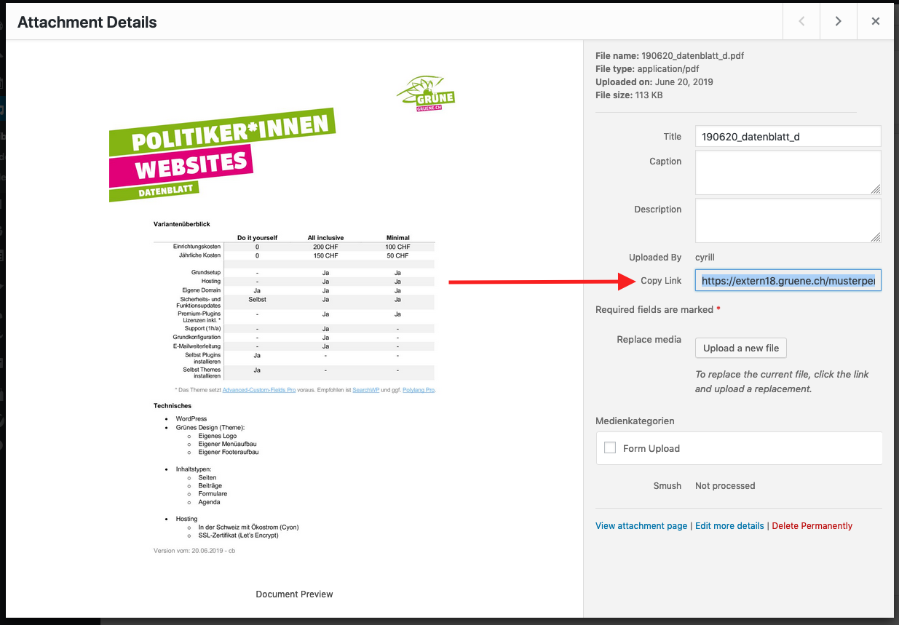

## Precondition

Make sure you
1. are [logged in](2-1-login.md).

## The Library

You can manage your assets like PDFs, images etc. in the media library. 
To upload new content, you may just drag it into the media library.

## Images

### Size

It's best practice to upload images in a **high resolution**. WordPress will 
automatically downscale the image and serve the correct size (depending on 
the visitors device and internet connection).

If you have the choice use images with a **landscape aspect ratio**, they work 
better with the different screen formats.

### Format

For the web, it's best to use _.jpeg_ for photos and _.png_ for graphics and 
images with text in it.

### Focal Point

Because screens have different formats, you should set the focal point of 
your image. **This prevents wired cropping.** To set the focal point, change 
in to the edit screen by clicking the pen on the image (hover your mose over 
it). Just change the value and close the dialog box. It is saved automatically.

## Media Link

If you need the url of an asset, you can get it using the _Copy Link_:

Just click the _Copy Link_ label and the link will be highlighted and is 
ready to copy.