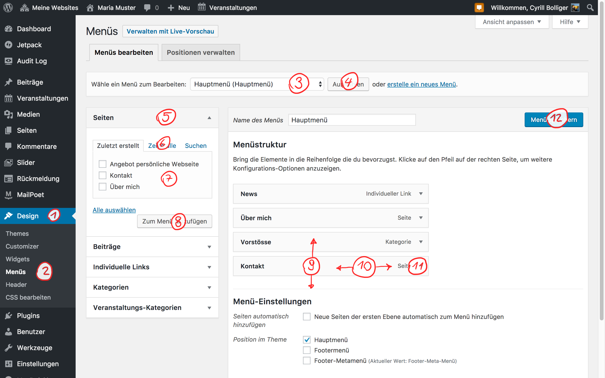
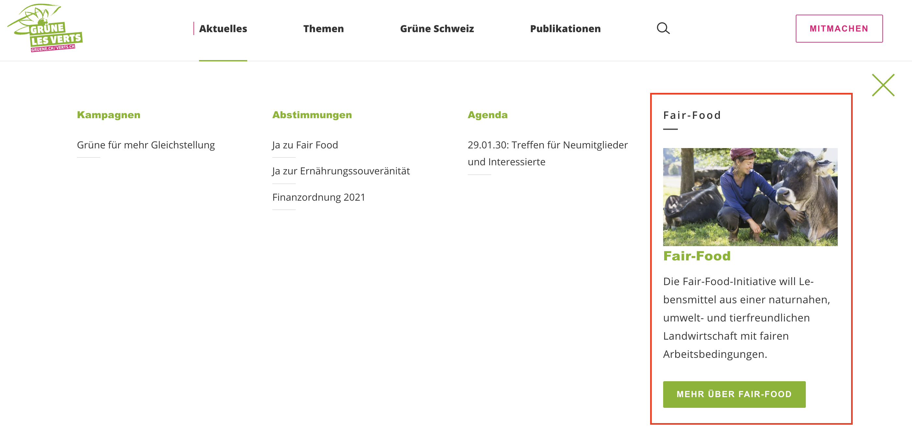
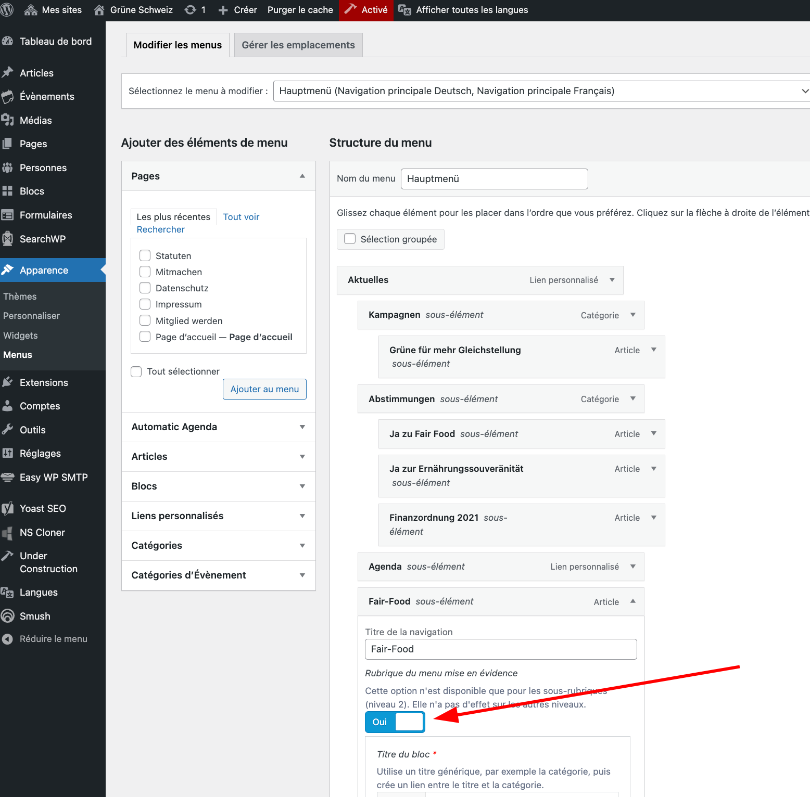
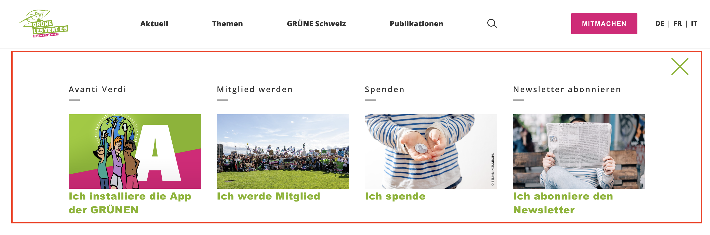

## Precondition

Make sure you
1. are [logged in](2-1-login.md).
1. have already created the content, that you want to link in the navigation.

## How the navigation works

Unlike you may know it from other website systems or the filesystem on your 
computer, the WordPress Navigation is independent from your posts and pages. 
This comes with the advantage of great flexibility at the price of 
counterintoutiveness.

> Think of the navigation as a big list of links, hierarchically ordered. If 
you create a new page, you have to explicitly add it to the link list aka 
navigation.

## Edit the navigation

1. In the [backend](1-2-terms.md#backend) goto **Design** (1) **> Menus** (2).
1. Select the navigation you want to edit (3) and click _select_ (4). 
Generally you want to edit the _main-navigation_. 
1. To add a page, expand the page accordion element on the left (5), tick 
the page you want to add (7) and click _Add to Menu_ (8). If the page isn't 
in the list click _View All_ to browse the full list (6).
1. The page is now appended to the bottom of your link list. Drag it into the 
right order (9) and the right hierarchy (10).
1. When expanding the newly added navigation entry (11) you, you can 
customize it's label in the menu or remove it.
1. Finally you have to save the changes (12).

> **Note**: Limit the number of top level menu entries to a maximum of five. 
Nest your navigation if you have more entries to add. To have **at most five 
top level entries** is no only best practice in terms of user experience, but
also a design limitation of the theme.  

### Nesting the entries

Nest your navigation by click dragging any item to the right, just below its 
future parent item. You can have at most three navigation levels.

> **Note**: If you nest the navigation, your root element is no longer 
clickable (it just opens the subnavigation). If you want the root element to 
be a reachable link, add it again as submenu entry. You may want to rename the 
root element (11).

### Adding posts

Usually you only add pages directly to the navigation. Posts are normally 
linked over it's category. There may however be exceptions. Add them 
similarly as pages.

### Categories / Archives

Categories in the navigation add links to the archive page of all posts of 
the given category. New posts will be added automatically, you won't have to 
change the navigation.

### Custom Links

_Custom Links_ can be used to add some external links to the navigation. This
can, for example come in handy, if you want to link to the page of your party.

### Featured Menu Items

If you need only two menu levels, you can use the _Featured Menu Item_ setting
to put a spotlight on a specific entry. To do so, toggle the _Featured Menu 
Item_ setting and enter the required information.

> **Note**: This setting only works on menu level 2 (in the screenshot above,
> menu level 1 is _Aktuelles_, menu level 2 is _Kampagnen_, _Abstimmungen_, 
> _Agenda_ and _Fair-Food_).

It is also possible to feature all entries. Make sure there are no more than 
four. Here an example for the [get active](3-3-header.md#get-active-button) 
menu:

