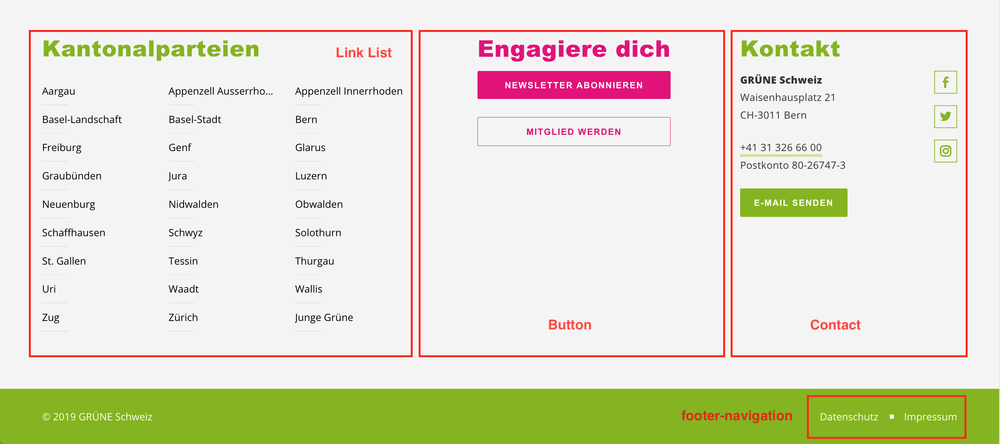

## Precondition
We assume you have already gathered some experience with your website and know
the basics terms, how to edit or add a post etc.

## Anatomy of the Footer

The upper part (grey) of the footer consists of multiple widgets, while the 
lower part (green) contains simply a menu.

### Footer Widgets

We generally advise you to use the three widgets _Link List_, _Button_ and 
_Contact_ as your footer elements, but you are free to experiment as well 
with the others.

#### Add or Edit Widgets

Go to **Design** > **Widgets**. While you have the footer widget zone on the 
right hand side, you'll find the available widgets on the left. If you want to 
add a new widget to the footer, choose on the left and drag it over into the 
_Footer_ zone. Expand the widget in the footer widget zone to edit it. 

### Footer Navigation

The footer navigation in the green bar is just another navigation. You can 
edit it like the main navigation (under **Design** > **Menu**). Keep it very 
lean (one to three entries only) and don't nest it.

## Legal limitations

The swiss laws oblige you, to have your address available from every page (if
 you sell things or raise funds). Therefore we advise you to use the _Contact_ 
 widget. Alternatively you may also add an imprint page and link it in the 
 footer navigation. 