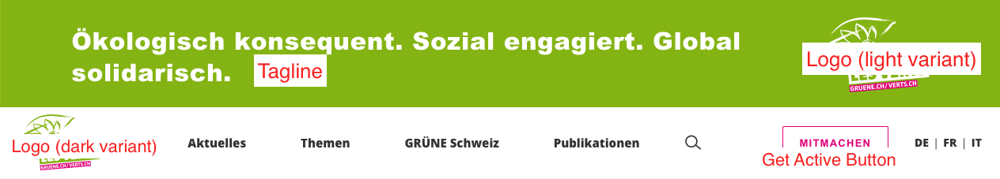
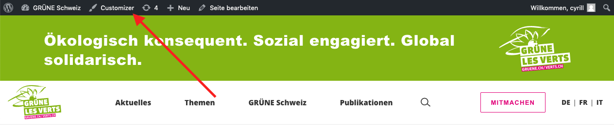

## Precondition
We assume you have already gathered some experience with your website and know
the basics terms, how to edit or add a post etc.

## Anatomy of the Header
The green section on the very top (only visible when you first visit the 
website after a few hours) and the white bar with the navigation below form 
the header.

How you can edit the navigation is explained in the dedicated chapter
[navigation](2-8-navigation.md). Everything else is explained here.

## Edit the Header with the Customizer
The _tagline_, the _logos_ and the _get active button_ can be easely managed 
through WordPress' _Customizer_. To access the Customizer, log in, go to the 
frontend and click the Customizer button in the admin bar.

### Tagline
In the Customzier, go to _Site Identity_ and you will find the _Tagline_. 
Keep it short and verify it looks good on mobile devices as well (simulate 
different devices using the device icons on the bottom).

### Logo
You may change the logo also in the Customizer under _Site Identity_. Please 
upload the inverted version (white grphics, green font) as the light variant.
It is placed in the green section.

> If you have, it's best to upload the logos as compressed .svg files. 
Alternatively you may also upload them as .png files. In either case, verify 
the have a transparent background!

Use a .png for the site icon.

### Get Active Button

Also the _Get Active Button_ is edited in the Customizer, under, surprise, 
surprise _Get Active Button_ 😉. If you don't want to have the button, just 
leave the fields empty.