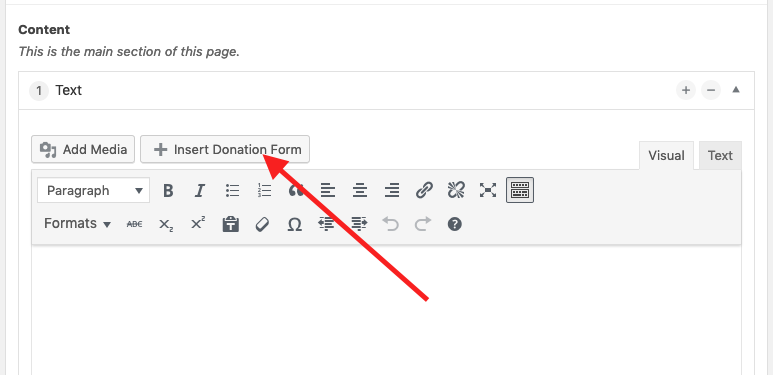

## Precondition

### Payment Partner
We partner with [RaiseNow](https://raisenow.com) for online donations. There 
is a pay as you go subscription model without fixed costs or you can 
get an advanced subscription. Get a contract, before you proceed.

### Plugin
If your website wasn't installed by us, you may have to install the 
[RaiseNow donation forms](https://github.com/grueneschweiz/wp-raisenow-community-plugin/releases/latest)
plugin.

### Know WordPress Basics
We assume you have already gathered some experience with your website and know
the basics terms, how to edit or add a post etc.

## Configuring the online donation forms
In the backend goto **Settings** > **Online donations**.

### API-Key
The API-Key is provided to you by RaiseNow. If you don't add it, online 
donations won't work!


### Custom CSS
We recommend you to copy the following lines into the _Custom CSS_ field, so 
the donation form works better with our theme.
```css
.lema-container a {
	box-shadow: none;
}

.select2-drop ul li::before {
	content: none;
}
```

## Adding a donation form
In your post or page, where you want to add the donation form, add a text block.
Just above the WYSIWYG Editor you'll find a button _Insert Donation Form_. It
 will insert a so called _short code_ that will be transformed into the 
 donation form on the frontend.



## Trouble shooting

### The form doesn't appear
This is most certainly a problem with your [API-Key](#api-key).

### I get an error when making payments
Usually when RaiseNow confirms you the contract, the put the donation form in
 _testing mode_, so you can make test donations without having to pay (read 
 the details in the email from RaiseNow). To get the form accepting real 
 value, ask RaiseNow to put the form in _production mode_. 
